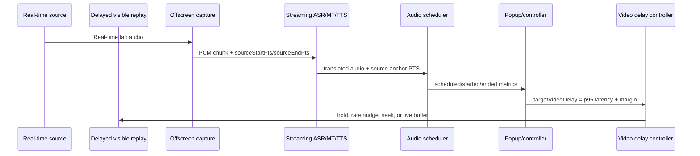

# fix: Stabilize simulcast audio/video sync

## Overview

The current simulcast path already uses Chrome MV3 `tabCapture`, an offscreen document, a persistent Volcengine AST WebSocket, PCM upload, page video delay control, and dynamic sync feedback. The remaining problem is that the system still estimates delay from wall-clock events and plays translated audio as completed HTML audio segments. This makes audio/video sync sensitive to subtitle timing, TTS sentence boundaries, browser timers, and playback queue backlog.

The fix is to make source media time the shared contract: capture source audio with timestamps, preserve or infer the source PTS through ASR/translation/TTS, schedule translated audio on an `AudioContext` clock, and drive video delay from measured per-segment latency instead of "received now, play now" behavior. For strict audio/video sync, the real-time source path and the user-visible delayed playback path must be separate; directly seeking or pausing the same page video is only a best-effort fallback because it also changes the audio that `tabCapture` sends to the translation pipeline.

## Problem Frame

Translated speech cannot be produced before the source speech has been heard, recognized, translated, and synthesized. Model optimization can reduce this delay, but cannot remove it. To make the translated audio match the visible picture, the visible video must be delayed to a controlled target timeline while the source audio continues feeding the translation system in real time. If the same `<video>` element is both the source and the delayed display, seeking it backward delays the source too, so the system loses the lookahead needed to prepare translated speech.

## Requirements Trace

- R1. Reduce perceived translated speech latency without regressing current tab-audio capture.
- R2. Keep translated audio aligned with the visible video using source media time, not wall-clock arrival time.
- R3. Avoid unbounded queue growth and cumulative delay drift during long videos or live streams.
- R4. Preserve the existing accessible-`<video>` path as fallback while adding a strict-sync path with separate real-time source and delayed visible playback.
- R5. Keep current Volcengine AST support usable while leaving room for WhisperLiveKit, SimulStreaming, or Qwen3-TTS adapters.

## Scope Boundaries

- This plan does not require immediately replacing Volcengine AST.
- This plan does not promise strict sync for DRM/EME video or sites that block capture.
- The first implementation target can keep the accessible page video fallback, but strict sync requires a separate delayed visible playback surface. Arbitrary-tab replay is a later phase because it changes the viewing surface.
- Sokuji should be used as an architecture reference only unless license implications are explicitly accepted.

## Context & Research

### Relevant Code and Patterns

- `src/offscreen/simulcast-audio.ts` captures tab/mic/file/url audio, sends PCM to AST, buffers TTS chunks, and starts translated playback only on `TTSSentenceEnd`.
- `src/offscreen/pcm-audio.ts` currently chunks 16 kHz 16-bit PCM at `AST_PCM_CHUNK_BYTES = 3200`, which is about 100 ms per chunk. This means the current main path is not a 1-5 second MediaRecorder upload pipeline.
- `src/offscreen/translated-audio-queue.ts` uses Blob URLs, `HTMLAudioElement`, `Date.now()`, and `setTimeout()` for translated audio playback. It has backlog-based rate control, but not source-PTS scheduling.
- `src/content/simulcast-video-sync.ts` already delays accessible page video by seeking VOD or buffering live playback, samples video clock through `requestVideoFrameCallback` when available, and applies rate/seek corrections.
- `src/popup/simulcast-dynamic-sync.ts` and `src/popup/index.ts` estimate dynamic delay from source subtitle wall time and translated-audio playback wall time. This is useful as a fallback, but it is not a stable media timeline.
- Tests already exist around translated audio queue, video sync, dynamic sync, AST session, and PCM helpers.

### External References

- Sokuji: browser/desktop live speech translation reference with local and cloud providers, but AGPL-3.0.
- WhisperLiveKit: self-hosted ultra-low-latency speech-to-text with native WebSocket API and translation option.
- SimulStreaming: MIT simultaneous speech-to-text/translation project with incremental policy and long-form speech focus.
- Qwen3-TTS: Apache-2.0 streaming TTS candidate.
- Chrome `tabCapture`: current-tab audio/video MediaStream capture and explicit audio re-output behavior.
- MDN AudioWorklet: low-latency audio processing on a dedicated audio thread.
- MDN AudioContext timing: `currentTime`, `getOutputTimestamp()`, and `outputLatency` are the right clock surfaces for audio scheduling.
- MDN `HTMLMediaElement.captureStream()`: useful for accessible media, but limited availability and not a universal fallback.

## Key Technical Decisions

- Keep Volcengine AST for the first sync fix. The current code already uses a persistent WebSocket, so replacing the provider before measuring would hide the main timeline problem.
- Replace wall-clock sync as the primary mechanism with source PTS. Wall-clock events remain fallback telemetry only.
- Replace translated-audio playback with an `AudioContext` scheduler. `HTMLAudioElement` is acceptable for simple playback, but weak for precise scheduling and output-latency accounting.
- Measure queue duration in milliseconds, not segment count. Segment count does not reveal whether backlog is 300 ms or 8 seconds.
- Treat direct `<video>` delay as fallback only. The strict-sync design must keep one real-time source feeding translation while showing a delayed replay path to the user.

## High-Level Technical Design

> This illustrates the intended approach and is directional guidance for review, not implementation specification. The implementing agent should treat it as context, not code to reproduce.

## Implementation Units

- [ ] **Unit 1: Add latency telemetry and source timeline model**

**Goal:** Make latency visible by recording capture, send, first subtitle, first TTS chunk, audio scheduled, audio started, and video media-time samples.

**Requirements:** R1, R2, R3

**Dependencies:** None

**Files:**
- Modify: `src/offscreen/simulcast-audio.ts`
- Modify: `src/offscreen/volcengine-ast-session.ts`
- Modify: `src/popup/index.ts`
- Modify: `src/popup/simulcast-dynamic-sync.ts`
- Test: `tests/unit/simulcast-dynamic-sync.test.ts`
- Test: `tests/unit/volcengine-ast-session.test.ts`

**Approach:**
- Add structured telemetry events with monotonic timestamps and optional source PTS.
- Keep existing UI status text, but add enough internal fields to identify whether delay is from capture, AST, TTS, playback scheduling, or queue backlog.
- Treat Volcengine subtitle `startTime` as provider-specific and do not assume it is trustworthy until verified.

**Patterns to follow:**
- Existing `translatedAudio` and `videoClock` message forwarding through `simulcast:update` and `simulcast:popupUpdate`.

**Test scenarios:**
- Happy path: simulated source subtitle plus translated audio event produces a bounded delay sample with expected confidence.
- Edge case: missing source anchor does not emit a delay sample.
- Error path: provider frames without timestamp fields still produce fallback telemetry without throwing.

**Verification:**
- A mocked AST session can show per-stage timestamps in state without starting live credentials.

- [ ] **Unit 2: Move capture from ScriptProcessor to AudioWorklet with PTS-bearing PCM chunks**

**Goal:** Lower capture jitter and attach source audio PTS to every PCM packet.

**Requirements:** R1, R2

**Dependencies:** Unit 1

**Files:**
- Modify: `src/offscreen/simulcast-audio.ts`
- Modify: `src/offscreen/pcm-audio.ts`
- Create: `src/offscreen/simulcast-capture-worklet.ts`
- Modify: `vite.config.ts`
- Test: `tests/unit/pcm-audio.test.ts`
- Test: `tests/unit/simulcast-offscreen-build.test.ts`

**Approach:**
- Use AudioWorklet for capture/downsample framing, keeping the existing output path that replays original tab audio through a gain node when needed.
- Emit chunks with sequence, sample count, sample rate, source start/end PTS, capture audio context time, and performance time.
- Keep the existing 16 kHz s16le AST payload for Volcengine compatibility, but wrap it in local metadata before sending.

**Patterns to follow:**
- Existing offscreen bundle entry pattern for `simulcastOffscreen`.

**Test scenarios:**
- Happy path: 48 kHz input produces 16 kHz PCM chunks with monotonically increasing PTS.
- Edge case: partial samples are retained until a full chunk can be emitted.
- Error path: unsupported AudioWorklet falls back to the current ScriptProcessor path with a telemetry flag.

**Verification:**
- Unit tests prove chunk size, sequence, and PTS monotonicity.

- [ ] **Unit 3: Replace translated playback queue with source-anchored AudioContext scheduling**

**Goal:** Stop treating translated audio as "play when received"; schedule it against source PTS plus target video delay.

**Requirements:** R2, R3

**Dependencies:** Unit 1

**Files:**
- Modify: `src/offscreen/translated-audio-queue.ts`
- Modify: `src/offscreen/simulcast-audio.ts`
- Test: `tests/unit/translated-audio-queue.test.ts`

**Approach:**
- Introduce a translated audio item contract containing source anchor PTS, audio duration, decoded duration, queue duration, and desired play-at context time.
- Use `AudioContext.currentTime` for scheduling, `getOutputTimestamp()` for mapping to performance time, and `outputLatency` when available for output-delay accounting.
- Decode and schedule audio through `AudioBufferSourceNode` where segments are self-contained. If AST TTS chunks are not independently decodable until sentence end, keep segment-level scheduling first and record first-chunk delay as a provider limitation.
- Compute backlog by queued audio duration and scheduled lateness, not queued segment count.

**Patterns to follow:**
- Existing queue tests and playback status callbacks.

**Test scenarios:**
- Happy path: two translated segments with source anchors are scheduled in order at expected context times.
- Edge case: late segment starts immediately only when it is inside the accepted lateness window.
- Error path: decode failure reports playback error and advances the queue.
- Integration: backlog duration above threshold increases playback rate or triggers a resync event.

**Verification:**
- Mocked `AudioContext` tests prove scheduling and queue-duration accounting independent of `Date.now()`.

- [ ] **Unit 4: Split real-time source and delayed visible playback for strict sync**

**Goal:** Stop relying on the same page video as both translation source and delayed display when strict sync is requested.

**Requirements:** R2, R4

**Dependencies:** Units 1-3

**Files:**
- Modify: `src/content/simulcast-video-sync.ts`
- Modify: `src/offscreen/simulcast-audio.ts`
- Modify: `src/popup/index.ts`
- Test: `tests/unit/simulcast-video-sync.test.ts`
- Test: `tests/unit/simulcast-offscreen-build.test.ts`

**Approach:**
- Keep the current direct page-video delay as a compatibility fallback with clear status text.
- Add a strict-sync mode that keeps the source tab/video advancing in real time and renders a delayed visible replay surface.
- Prefer a captured-tab delayed player in an extension page/window for arbitrary tabs. For accessible page media, evaluate `HTMLMediaElement.captureStream()` only as an optimization, not as the universal path.
- Avoid rendering the delayed captured stream back into the captured tab to prevent recursive capture.
- Mute or visually hide the real-time source only after confirming capture still receives audio; do not use source `muted` when it would silence capture.

**Patterns to follow:**
- Existing hold/release and video-clock reporting flow, but applied to the delayed visible surface rather than the real-time source.

**Test scenarios:**
- Happy path: strict-sync mode reports that source remains real-time while delayed visible playback uses the target delay.
- Edge case: `captureStream()` unavailable falls back to tab-capture replay or direct page-video fallback with a clear limitation status.
- Error path: DRM/protected media refuses capture and reports unsupported strict sync without stopping subtitles-only mode.
- Integration: stop clears delayed replay state without leaving the source hidden or muted.

**Verification:**
- Browser verification uses a known local video and confirms the translated-audio anchor is scheduled before the corresponding delayed visible frame.

- [ ] **Unit 5: Rework dynamic video delay around p95 source-to-audio latency**

**Goal:** Drive video delay from recent measured latency distribution with conservative smoothing.

**Requirements:** R2, R3, R4

**Dependencies:** Units 1, 3, and 4

**Files:**
- Modify: `src/popup/simulcast-dynamic-sync.ts`
- Modify: `src/popup/index.ts`
- Modify: `src/content/simulcast-video-sync.ts`
- Test: `tests/unit/simulcast-dynamic-sync.test.ts`
- Test: `tests/unit/simulcast-video-sync.test.ts`

**Approach:**
- Maintain a rolling 30-60 second latency window.
- Set `targetVideoDelay = p95(endToEndLatency) + 150-250 ms margin`, clamped to a configured maximum.
- Increase delay quickly when p95 rises; decrease slowly when latency improves.
- Use rate nudges for small VOD drift, seek for larger drift, live buffering for live, and resync when the queue is unrecoverable.
- Keep the current hold-until-first-audio UX, but release based on the first source-anchored audio schedule rather than the first wall-clock playback event.

**Patterns to follow:**
- Existing `applyDynamicVideoSyncControl`, `holdVideoUntilTranslatedAudio`, and `requestVideoFrameCallback` sampling flow, with strict-sync control targeting the delayed visible replay when enabled.

**Test scenarios:**
- Happy path: stable samples converge to expected target delay.
- Edge case: brief latency spike raises delay, then decays slowly after recovery.
- Error path: no video found keeps sync disabled and reports status without breaking audio.
- Integration: target delay update under 150 ms does not seek or rate-nudge.

**Verification:**
- Tests show delay changes are bounded and do not repeatedly seek on small measurement noise.

- [ ] **Unit 6: Add backpressure and stale-audio policy**

**Goal:** Prevent translated audio from drifting farther behind over time.

**Requirements:** R1, R3

**Dependencies:** Unit 3

**Files:**
- Modify: `src/offscreen/translated-audio-queue.ts`
- Modify: `src/offscreen/simulcast-audio.ts`
- Modify: `src/popup/index.ts`
- Test: `tests/unit/translated-audio-queue.test.ts`

**Approach:**
- Define queue states by queued duration: normal, slight catch-up, aggressive catch-up, and hard resync.
- Prefer trimming silence and stale unscheduled audio before speeding speech beyond acceptable quality.
- Surface a status event when hard resync occurs so the video delay controller can establish a new anchor.

**Patterns to follow:**
- Existing backlog-based playback-rate logic, but convert it from segment count to duration.

**Test scenarios:**
- Happy path: 300 ms backlog applies mild catch-up.
- Edge case: backlog above hard threshold drops stale audio and emits resync.
- Error path: volume zero or subtitles-only mode does not enqueue audio.

**Verification:**
- Long mocked sequence cannot grow queue duration without bound.

- [ ] **Unit 7: Evaluate optional backend adapters after local timing is proven**

**Goal:** Decide whether Volcengine AST is still the bottleneck after the browser timing path is correct.

**Requirements:** R1, R5

**Dependencies:** Units 1-6

**Files:**
- Create: `docs/plans/2026-06-18-001-fix-simulcast-av-sync-results.md`
- Modify: `src/translation/config.ts`
- Modify: `src/offscreen/simulcast-audio.ts`
- Test: `tests/unit/translation-config.test.ts`

**Approach:**
- Benchmark existing Volcengine AST by source/target language and provider mode before adding a second backend.
- If provider-side latency dominates, prototype a provider adapter boundary that can support WhisperLiveKit/SimulStreaming for streaming ASR/translation and Qwen3-TTS for streaming synthesis.
- Use Sokuji only as reference architecture unless the product accepts AGPL obligations.

**Patterns to follow:**
- Existing provider config style under `SimultaneousInterpretationConfig`.

**Test scenarios:**
- Happy path: config can select the existing provider without behavior change.
- Edge case: unsupported provider selection falls back or reports a clear error.
- Test expectation for backend performance: use manual benchmark notes because model latency depends on hardware and credentials.

**Verification:**
- A short benchmark table identifies whether capture, provider, TTS, scheduling, or video control is now the dominant delay.

## System-Wide Impact

- **Interaction graph:** content script video clock, popup controller, background relay, offscreen capture, AST session, and translated audio queue all participate in one timing loop.
- **Error propagation:** capture/provider/decode/schedule errors should surface as status messages without stopping unrelated transcription flows.
- **State lifecycle risks:** stopping simulcast must clear worklet, active audio schedules, pending video holds, and dynamic sync state.
- **API surface parity:** file/url transcription may share offscreen capture primitives but should not inherit video-delay behavior.
- **Integration coverage:** mocked offscreen + content-script tests are required because unit tests alone cannot prove message ordering. Browser verification with a known local video is required before claiming strict sync.
- **Unchanged invariants:** captured tab audio must not be muted at the source video; original-output mute remains controlled through the offscreen gain path.

## Risks & Dependencies

| Risk | Mitigation |
|------|------------|
| Volcengine AST does not return reliable source timestamps | Use local PCM source PTS as the primary anchor and provider timestamps only as hints. |
| AST TTS chunks cannot be decoded before sentence end | Keep source-anchored segment scheduling first, measure first-chunk versus first-decodable latency, then decide whether to switch TTS backend. |
| Direct page video control breaks on some sites | Preserve fallback status and add arbitrary-tab delayed replay as a separate later phase. |
| DRM/EME video cannot be captured or redrawn | Treat as unsupported for strict sync and document the limitation. |
| AudioWorklet bundling fails in MV3/offscreen | Keep ScriptProcessor fallback until the worklet path is verified in the built extension. |
| Sokuji AGPL conflicts with product distribution | Reference concepts only; do not copy code without license review. |

## Documentation / Operational Notes

- Add a short internal note after implementation with measured latency per provider and language pair.
- Expose a diagnostic readout during development: capture-to-send, send-to-subtitle, subtitle-to-first-TTS, first-TTS-to-scheduled, scheduled-to-start, video delay, queue duration.
- Keep local credentials and provider keys out of committed fixtures.

## Sources & References

- Related code: `src/offscreen/simulcast-audio.ts`
- Related code: `src/offscreen/translated-audio-queue.ts`
- Related code: `src/content/simulcast-video-sync.ts`
- Related code: `src/popup/simulcast-dynamic-sync.ts`
- Related code: `src/popup/index.ts`
- External: `https://github.com/kizuna-ai-lab/sokuji`
- External: `https://github.com/QUENTINFUXA/WHISPERLIVEKIT`
- External: `https://github.com/ufal/SimulStreaming`
- External: `https://github.com/QwenLM/Qwen3-TTS`
- External: `https://developer.chrome.com/docs/extensions/reference/api/tabCapture`
- External: `https://developer.mozilla.org/en-US/docs/Web/API/AudioWorklet`
- External: `https://developer.mozilla.org/en-US/docs/Web/API/AudioContext/getOutputTimestamp`
- External: `https://developer.mozilla.org/en-US/docs/Web/API/AudioContext/outputLatency`
- External: `https://developer.mozilla.org/en-US/docs/Web/API/HTMLMediaElement/captureStream`
